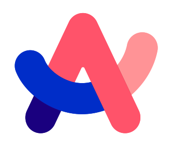
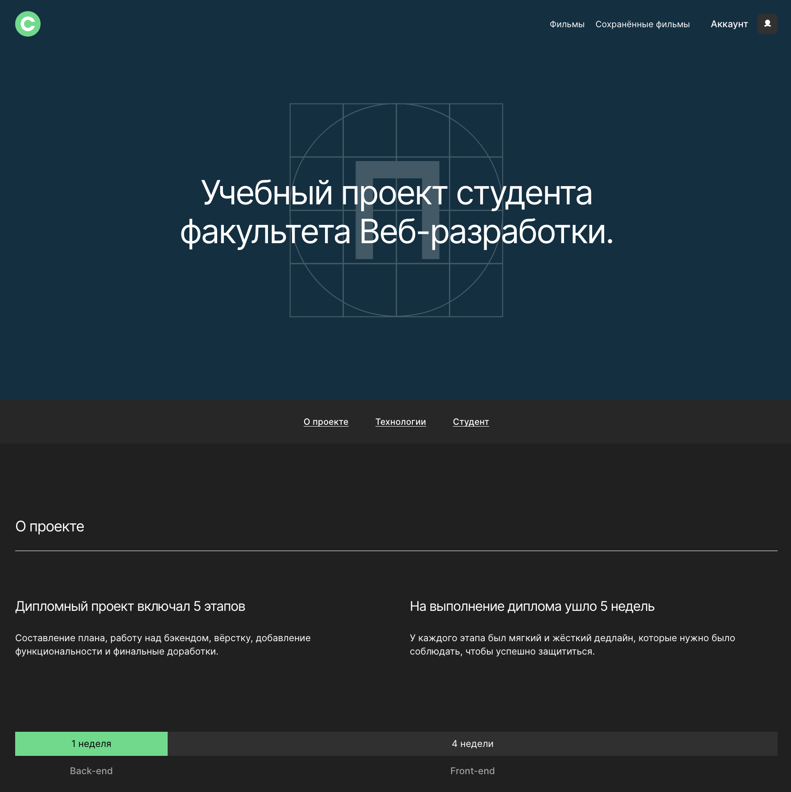
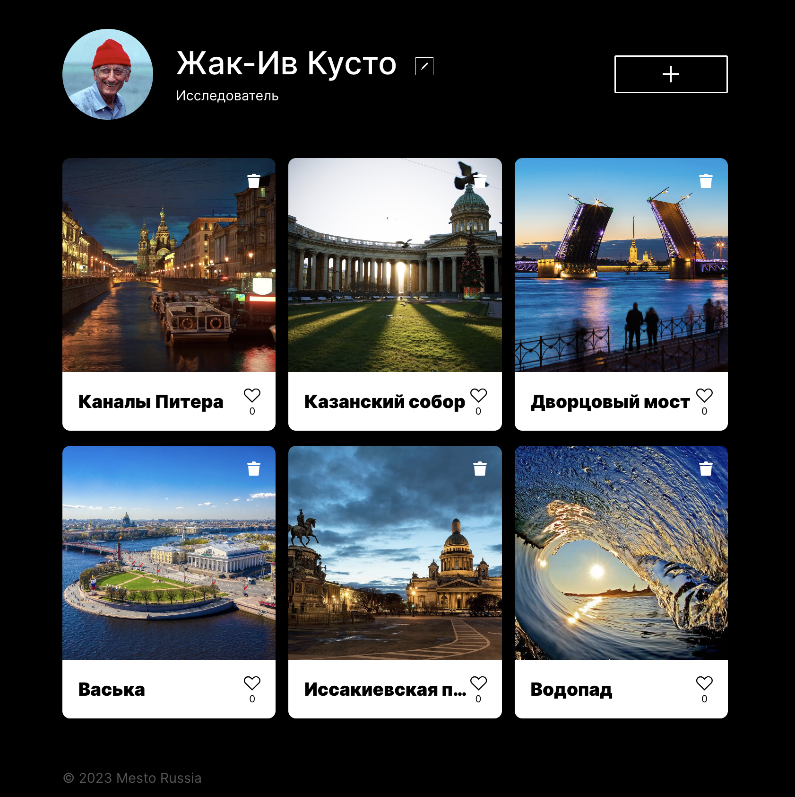
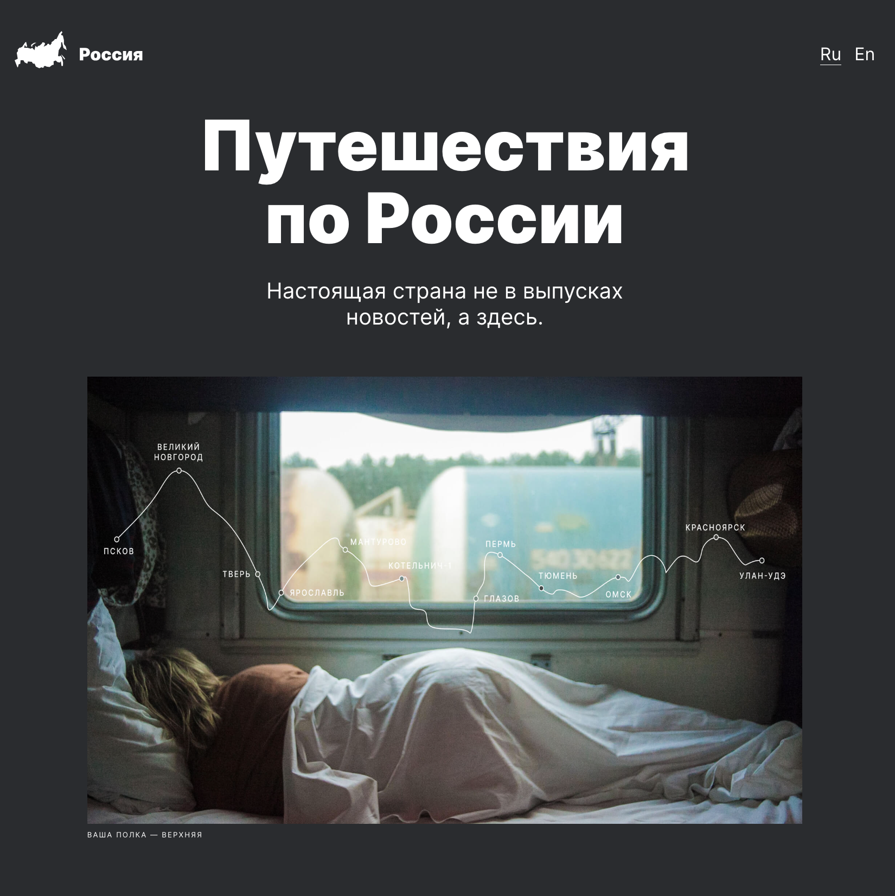
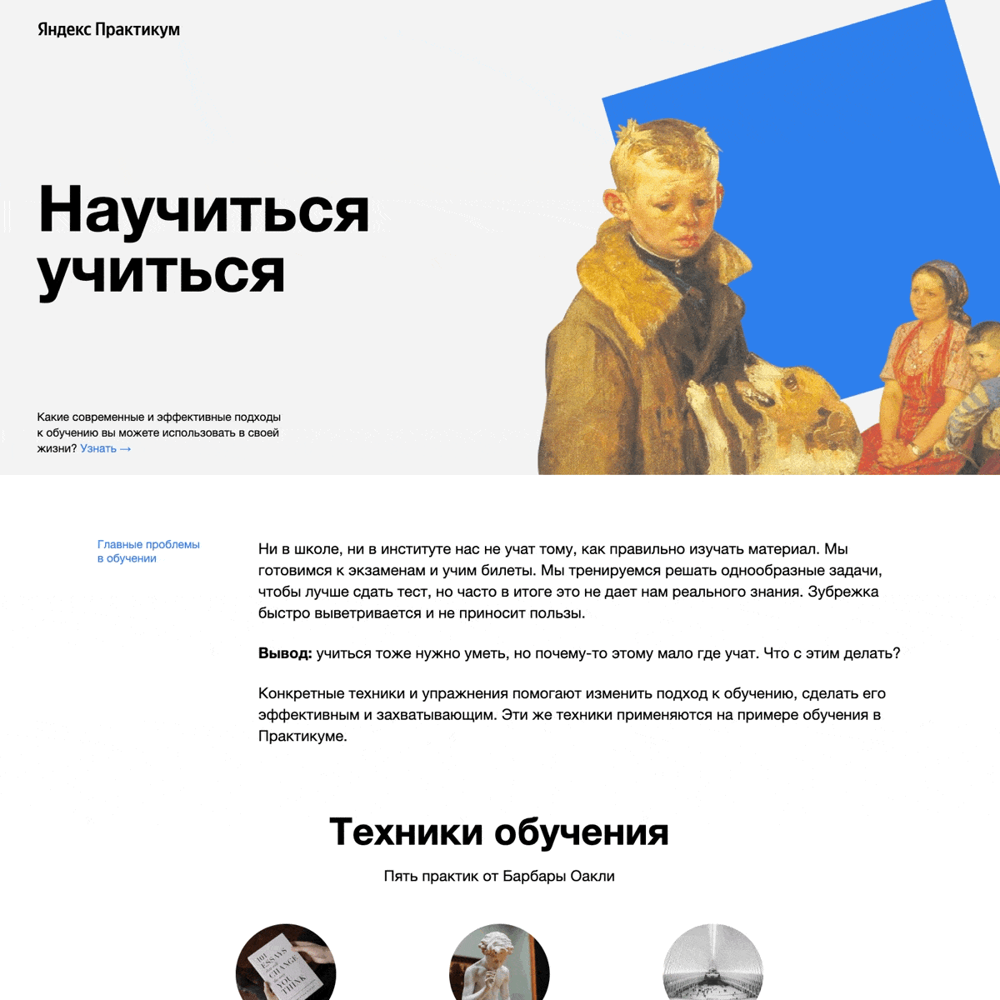

<h1 align="center">Всем, привет!&nbsp</h1>

## 👨🏻‍💻 Обо мне

**• 🌌 Стремлюсь к обогащению знаний, освоению новейших технологий и инструментов**

**• 🤝 Заинтересован в работе в гармоничном коллективе профессионалов и единомышленников**

**• 🧠 Легко принимаю критику и быстро набираюсь опыта в разработке**

**• 🧩 Осваиваю искусство создания лаконичного и понятного кода**
 

## 🤳🏼 Связь со мной

  &nbsp&nbsp
  &nbsp&nbsp
  

## 🛠️ Используемый стек и инструменты

  &nbsp
  &nbsp
  &nbsp
  &nbsp
  &nbsp
  &nbsp
  &nbsp
  &nbsp
  &nbsp
  &nbsp
  &nbsp
  &nbsp
  &nbsp
  &nbsp
  &nbsp
  &nbsp
  &nbsp
  &nbsp
  &nbsp
  &nbsp
  &nbsp
  &nbsp
  &nbsp
  &nbsp
  &nbsp

## 👨🏻‍🎓 Планирую изучить

  &nbsp
  &nbsp
  &nbsp
  &nbsp

## 💼 Мои проекты

  

    &nbsp;
    &nbsp;
  

  

    &nbsp;
    &nbsp;
  

## 📊 Статистика

